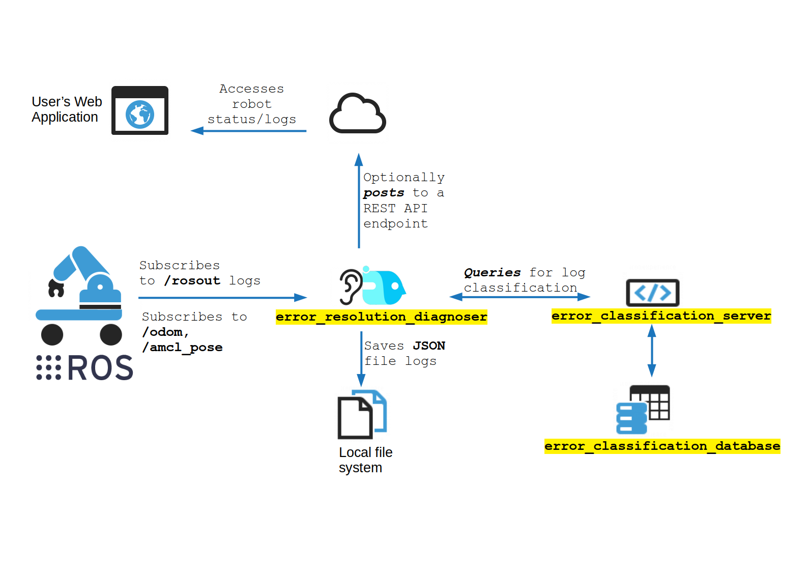
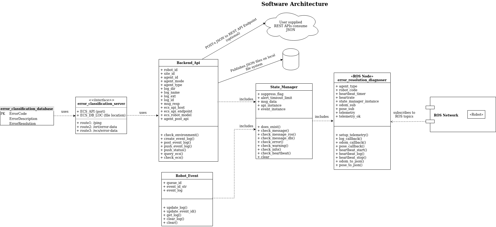

# error_resolution_diagnoser_ros2 Introduction 

## INTRODUCTION

### Purpose
This package provides a ROS software solution that enables robotic edge devices to propagate its states and error conditions to a remote central system, for the purpose of getting remote assistance and directives on the next course of action that would enable it to revert back to a non-erroneous state (normal operating condition).

### Scope
This package is targeted at all industrial users with robotic edge devices. The target end-users of this package will require no prior programming capabilities to be able to receive states and error conditions and focus on the purpose of resolving the standardized error.
  
## SOFTWARE ARCHITECTURE
The figure below shows the projected process flow of the proposed software architecture.

 

The architecture comprises of the following modules : 

**error_resolution_diagnoser** : 
A light-weight agent that streamlines the warnings and errors generated by robots, and create relevant JSON objects for incident management. It is a C++ based ROS-Node that is configurable, and can listen to various ROS topics.

**error_classification_database** : 
The database of error reported by multiple robot types, classified and segmented into groups for efficient incident management, and handling remote and algorithmic interventions. This is an attempt to simplify and democratize the errors logging for a broader robot user community, while also allowing for the use of newer modules and technologies. A proposed future attempt is to suggest the use of standardized error codes, in order to be platform, module or robot independent. Similar protocols has influenced the worldwide adoption of technologies such as HTTP, and computer diagnostics. 

Another critical advantage of this model is that the algorithmic and human-in-the-loop robot intervention and resolution can be tagged to the error codes, to reduce the robot downtime, and increase the robot efficiency. 

In order to maintain the democratic element of the basic `error_classification_database` (a premium version is managed by Team Cognicept), the proposal is to appoint moderators from Cognicept, ROS-Industrial, and the members of the ROS-I community to maintain, manage, endorse and support the robotic community with the access to the error classification capabilities. 

Cognicept will provide a basic Error reporting tool, accessible to public. The Errors reported by them, will be assigned to the moderators in a distributed manner. The moderators, will reproduce the errors on their own system with the resources available, and upon careful analysis, will classify the errors into the designed buckets. A custom bucket is also proposed to cover the unorthodox errors.

The Community in general will be divided into two : 

1. Moderators :  Cognicept, ROS-I, ROS-I and CGS nominated members. No limit on the number of moderators. 
2. Members: ROS community worldwide. 
Members get the access to the basic error classification database, the error reporting tool, and a basic remote intervention tool for basic error handling. Some key algorithmic and remote intervention examples will be shared on the wiki page. 

**error_classification_server** :
This is a Sanic based web api server that establishes REST endpoints to communicate with the the `error_classification_database`.

**Remote Intervention Tool** : Remote intervention tools, that can be used to visualize the robot, and control it to clear the errors, and resume the tasks for the robot. 

The figure below shows the agent architecture in more detail:

The `error_resolution_diagnoser` establishes a unidirectional communication with the robot to just subscribe to important topics such as `rosout` that can ascertain the status of the robot. The agent does it with the following utility classes:

1. `State_Manager` - This is responsible for handling the message and deciding whether it needs to be suppressed or not. It has custom suppression algorithms implemented for varying severity levels. It also handles event logging and pushing JSON files by using `Robot_Event` and `Backend_Api` classes respectively as discussed below.

2. `Robot_Event` - This is responsible for grouping events based on an "event_id". If a current "event_id" is not available, the class randomly creates one.

3. `Backend_Api` - This is responsible for anything that the agent needs to communicate with the outside world. Specifically, creating JSON files in the local file system and communicating with the `error_classification_database` through the `error_classification_server`. Optionally, the api also allows "POST"-ing the generated JSON to a configurable POST REST API endpoint.